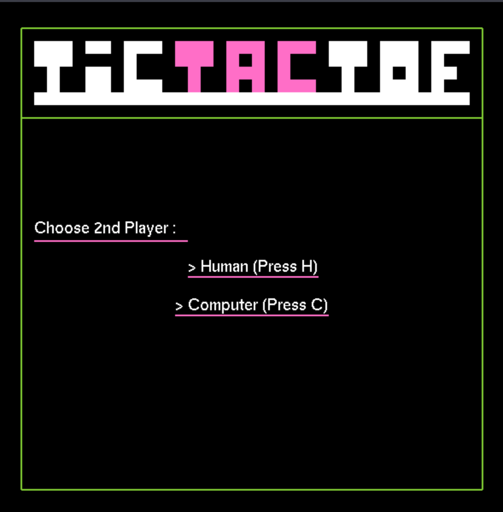
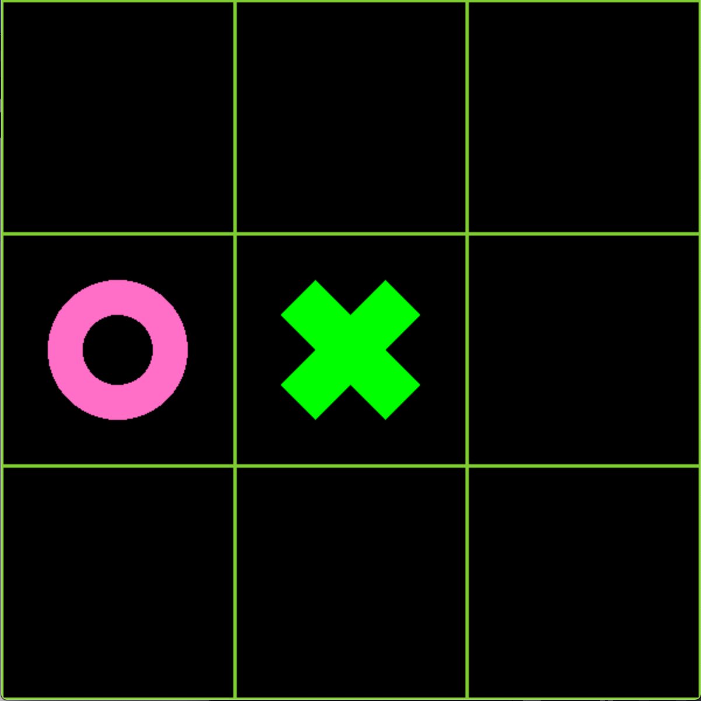
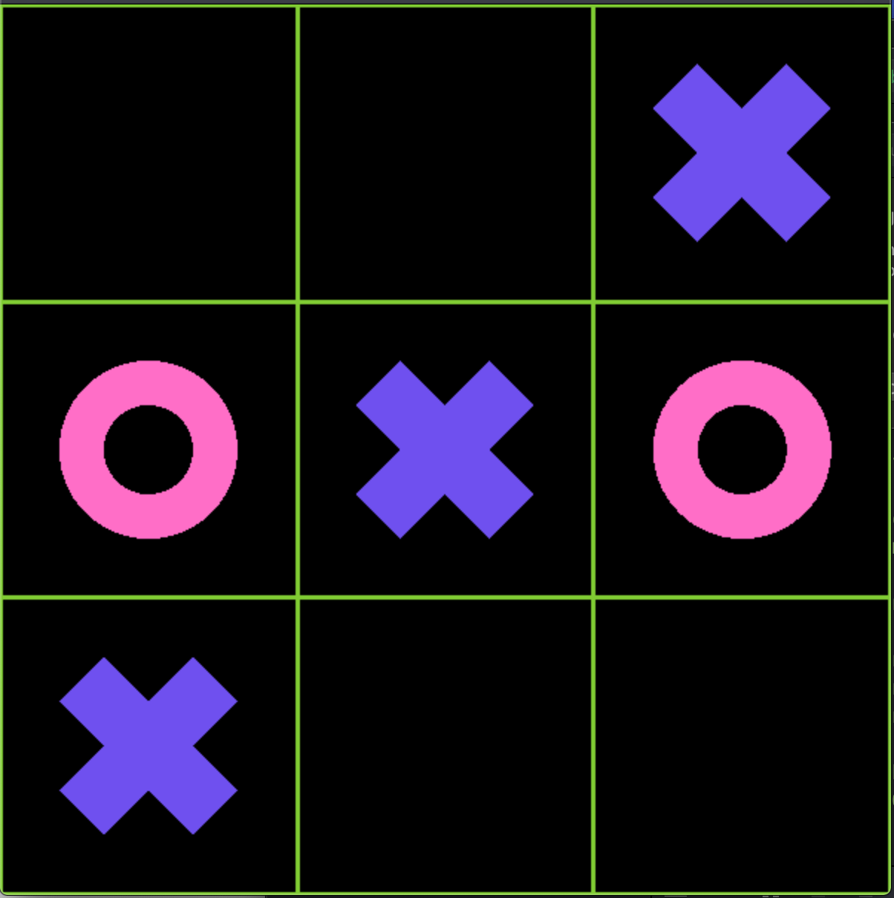

### TicTacToe
__Sumary:__
This application is a simple implementation of the classic game of Tic-Tac-Toe

__Features:__
* Single player mode (Good luck!)
* Multiplayer mode 

__Technologies:__
* C++
* Object oriented C++ wrapper for OpenGL (Outdated)

__Before you play:__
* Application might cause Macintosh computers to run hot due to the lack of the graphics processing power

